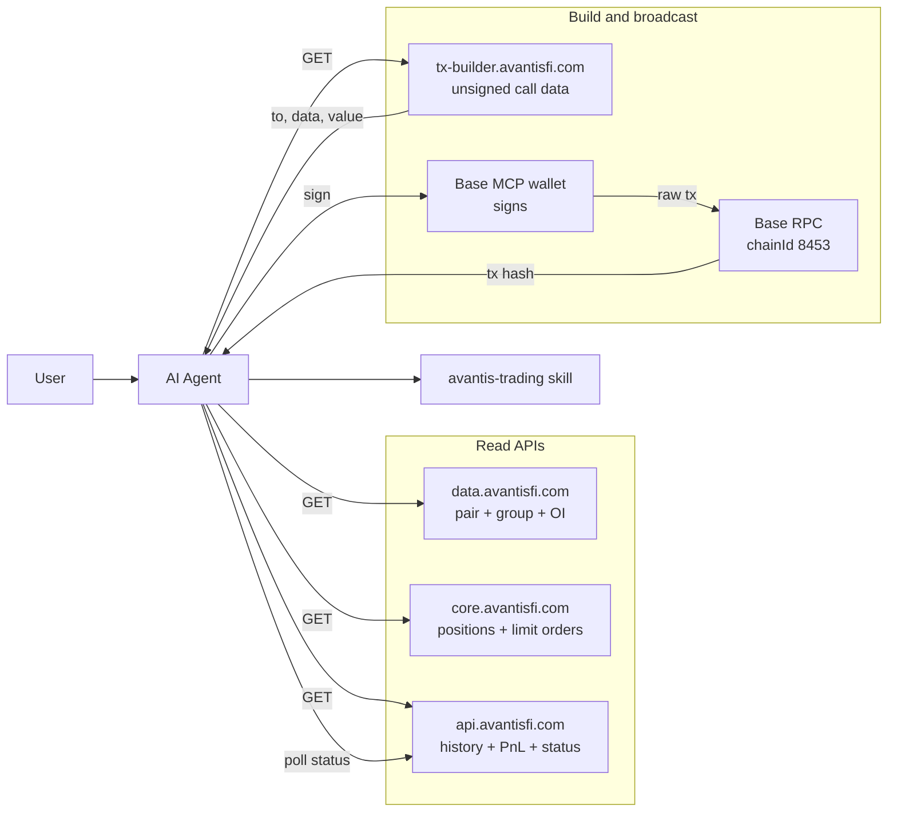

# Avantis Trading

Skill for AI agents that need to trade on Avantis perps (Base mainnet, chainId 8453). Covers every public Avantis API surface end-to-end: read pair config, build unsigned transaction call data, read positions and history, and poll order settlement.

This skill returns **unsigned** call data. Signing and broadcasting are the caller's job — typically delegated to the Base MCP wallet or any viem-compatible wallet.

## Architecture



## Service URLs (mainnet)

| Surface | Base URL | Reference |
| --- | --- | --- |
| tx-builder | `https://tx-builder.avantisfi.com` | [`tx-builder.md`](tx-builder.md) |
| data API | `https://data.avantisfi.com/v2/trading` | [`data-api.md`](data-api.md) |
| core backend | `https://core.avantisfi.com` | [`core-backend.md`](core-backend.md) |
| history API | `https://api.avantisfi.com` | [`history-api.md`](history-api.md) |

Contract-level reference (addresses, enums, scaling) lives in [`contracts.md`](contracts.md). End-to-end flows live in [`recipes.md`](recipes.md).

## Trading workflow

For any new trade, follow this checklist:

1. **(Optional) Resolve pair**: if the user gave a symbol, call `GET https://tx-builder.avantisfi.com/pairs` once to map `BTC/USD` → `pairIndex=1`. tx-builder also accepts `pair=BTC/USD` directly on `/trade/open`, so this step is only needed when you want pair metadata.
2. **Build call data** via tx-builder. Example: `GET https://tx-builder.avantisfi.com/trade/open?trader=0x...&pair=BTC/USD&side=long&collateralUsdc=100&leverage=10`. The service runs pre-trade validation by default and rejects with `400` if the trade would fail.
3. **Sign** `{ to, data, value }` from the response. Convert `value` with `BigInt(value)` (it's hex wei). The wallet handles `nonce` and `gas`.
4. **Broadcast** on Base (chainId 8453). The receipt contains a `MarketOrderInitiated` event; the `orderId` log field is what you'll poll on.
5. **Poll settlement**: `GET https://api.avantisfi.com/v2/market-order-initiated/status/:txHash` until `status` flips from `pending` to `executed` or `canceled`.
6. **Confirm position**: `GET https://core.avantisfi.com/user-data?trader=0x...` — the new trade appears in `positions[]`.

## Concepts an agent must know

- **Order types**: `market`, `limit`, `stop_limit`, `market_zero_fee`. The last one is the *zero-fee perp* (ZFP) path and uses a different leverage envelope.
- **Leverage envelope**: fixed-fee orders use `leverages.minLeverage`..`leverages.maxLeverage`; ZFP orders use `leverages.pnlMinLeverage`..`leverages.pnlMaxLeverage`. Both ranges come from the data API per pair.
- **Scaling** (handled by tx-builder for inputs / outputs, but useful when reading other APIs):
  - prices, leverage, percentages, slippage → `× 10^10`
  - USDC amounts → `× 10^6`
  - ETH amounts and `value` in call data → `× 10^18`
- **`value` is hex**: returned as `0x`-prefixed wei. Convert with `BigInt(value)`.
- **`from` is informational**: it indicates who must sign. For a delegated call (`&delegate=0x...`), `from` is the delegate's address, not the trader's.
- **`nonce` / `gas`** are never returned. The wallet manages them.
- **Pair separators**: `BTC/USD`, `btc-usd`, `eth_usd` all resolve to the same pair on tx-builder query params.

## Pre-trade validation

`tx-builder` enforces four checks on `/trade/open` before encoding. Each failure is a `400 BAD_REQUEST` with a human-readable message:

| Check | Source | Rejects when |
| --- | --- | --- |
| **Pair listed** | `data.avantisfi.com/v2/trading` | `isPairListed === false` |
| **Minimum position** | `pairMinLevPosUSDC` | `collateralUsdc × leverage < pairMinLevPosUSDC` |
| **Leverage envelope** | `leverages.*` | leverage outside `[minLeverage, maxLeverage]` (fixed-fee) or `[pnlMinLeverage, pnlMaxLeverage]` (ZFP) |
| **Liquidity** | `pairMaxOI − pairOI` and `groupMaxOI − groupOI` | `positionSize > min(pairAvail, groupAvail)` |

On success, `meta.validation` carries the computed envelope so the agent can surface headroom:

```json
"validation": {
  "positionSizeUsdc": 1000,
  "pairAvailableUsdc": 33683421.1,
  "groupAvailableUsdc": 31539778.34,
  "availableUsdc": 31539778.34,
  "minLeverage": 1,
  "maxLeverage": 75,
  "minPositionUsdc": 100,
  "isZfp": false
}
```

Pass `&skipValidation=true` to bypass — use only when the agent has already validated upstream or for synthetic test paths.

## Error envelope

All four API surfaces return JSON. There are **two shapes** an agent must handle:

**Modern shape** (tx-builder, data API, core backend):

```json
{ "ok": true, "data": { ... } }
{ "ok": false, "error": { "code": "BAD_REQUEST", "message": "...", "details": { ... } } }
```

Modern codes: `BAD_REQUEST`, `VALIDATION_ERROR`, `UPSTREAM_ERROR`, `NOT_FOUND`, `INTERNAL_ERROR`.

**Legacy shape** (history API):

```json
{ "success": true,  "data": { ... } }
{ "success": false, "errorMessage": "..." }
```

The history API **always returns HTTP 200**, even on logical errors. Check `success` before consuming `data`.

## Common recipes

Short summaries — full step-by-step versions in [`recipes.md`](recipes.md).

- **Open a market long** — one `/trade/open` call, sign, broadcast, poll status.
- **Close a trade fully** — read `/user-data`, then `/trade/close` with the full collateral.
- **Place a limit / stop-limit** — `/trade/open` with `orderType=limit` (or `stop_limit`) plus `openPrice`.
- **Set TP / SL** — `/tpsl/update`; the server fetches Pyth bytes by default.
- **Delegated trading** — `/delegate/set` once, then every subsequent build carries `&delegate=0x...`.
- **USDC approve** — `/token/approve?trader=...` (omit `amountUsdc` for unlimited).
- **Inspect a portfolio** — combine `/user-data` (open) + `/v2/history/portfolio/all/...` (closed) + `/v2/history/portfolio/profit-loss/...` (PnL).
- **Wait for settlement** — exponential-backoff poll of `/v2/market-order-initiated/status/:txHash`.

## Signing the response

### viem (TypeScript)

```ts
const r = await fetch(url).then((x) => x.json());
if (!r.ok) throw new Error(r.error.message);

const hash = await wallet.sendTransaction({
  to:    r.data.to,
  data:  r.data.data,
  value: BigInt(r.data.value),
});
```

### Base MCP wallet

Pass the same three fields to whatever `send_transaction` (or equivalent) tool the wallet exposes. The wallet supplies `chainId`, `nonce`, `gasLimit`, and signs. The agent only needs to forward the values.

## References

- [`tx-builder.md`](tx-builder.md) — every tx-builder endpoint with query params, response shape, and validation rules
- [`data-api.md`](data-api.md) — field reference for `data.avantisfi.com/v2/trading`
- [`core-backend.md`](core-backend.md) — `core.avantisfi.com` public endpoints
- [`history-api.md`](history-api.md) — all 7 `api.avantisfi.com /v2/...` endpoints
- [`contracts.md`](contracts.md) — Avantis contract addresses, enums, scaling, thresholds
- [`recipes.md`](recipes.md) — 8 concrete end-to-end flows
